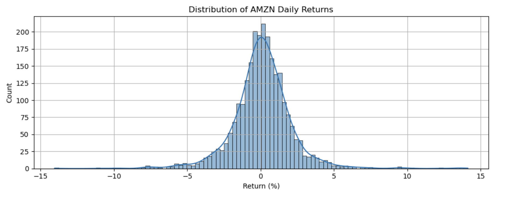
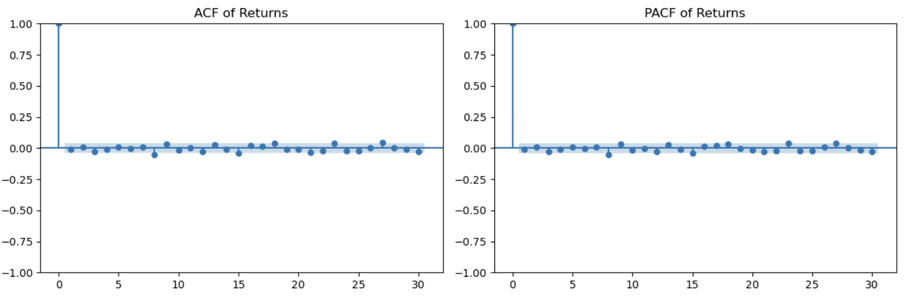
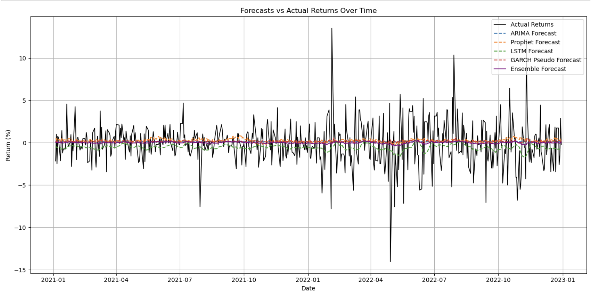

# Forecasting Daily Stock Returns

This project forecasts **daily stock returns** for a publicly traded company (e.g. Amazon) using 10+ years of historical data. Short-term stock returns are notoriously noisy and **volatile**; statistical theory often treats them as near-random walk processes. We implement several models—including statistical (ARIMA, GARCH), machine learning (LSTM, XGBoost), and hybrid (Facebook Prophet)—to capture different data patterns. By **ensembling** these forecasts, we aim to leverage complementary strengths of each approach (e.g. linear trends vs non-linear effects). Model performance is judged using standard forecast error metrics like RMSE and MAPE.

## Project Structure

* `/src/`: Python modules for data loading, feature engineering, modeling, evaluation, and explainability.
* `/notebooks/`: (Optional) example notebooks showcasing data exploration and results.
* `/data/`: (Empty) The pipeline downloads data via `yfinance`, so no raw data files are included.
* `/figures/`: Output plots (e.g. forecasts vs actuals) generated by the analysis.
* `requirements.txt`: Python package dependencies.
* `README.md`: This file, with project overview, financial context, and results.

## Installation

Install required libraries (tested on Python 3.8+). For example, using pip:

```bash
pip install -r requirements.txt
```

Required packages include: `pandas`, `numpy`, `yfinance`, `statsmodels`, `arch`, `prophet`, `tensorflow` (for LSTM), `xgboost`, `shap`, `scikit-learn`, etc. The `environment.yml` (if provided) specifies package versions for a conda environment.

## Data Extraction

We use the `yfinance` package to download daily price data. For instance, to analyze Amazon (ticker **AMZN**), we fetch \~10 years of daily `Close` prices and compute **daily returns** (% change). Missing days (e.g. weekends/holidays) are filled with the last known value and then returns are computed as percent changes. The resulting DataFrame has columns like `Close` and `Return` (%).

## Exploratory Data Analysis (EDA)

We begin by visualizing the return series and its properties. Daily returns of individual stocks typically have **heavy-tailed distributions** (more extreme values than a normal distribution) and little autocorrelation. For example, the histogram below shows Amazon’s daily return distribution, which is sharply peaked with fat tails (leptokurtic).



&#x20;*Figure: **Distribution of Amazon daily returns** (2013–2023). The histogram (blue bars) has a narrow center and long tails, indicating frequent small changes and rare large shocks. Such heavy tails are common in financial returns.*

We also examine autocorrelation: the ACF/PACF plots confirm that returns are nearly uncorrelated at all nonzero lags (the spike at lag 0 is trivial). This aligns with the Efficient Market Hypothesis that short-term returns are hard to predict.



&#x20;*Figure: **ACF and PACF of daily returns**. The autocorrelation and partial autocorrelation coefficients are essentially zero for all lags >0, indicating no obvious linear autocorrelation structure beyond randomness.*

In EDA, we also inspect features like rolling volatility (21-day std. dev.), moving averages, and lagged returns to use as predictors. We engineer features such as 21-day volatility and lagged returns (return on previous 1–3 days) to feed into machine learning models.

## Feature Engineering

From the price data, we compute:

* **Rolling Volatility:** 21-day rolling standard deviation of returns (captures recent volatility clustering).
* **Moving Averages:** 7-day and 21-day moving averages of the price (trend indicators).
* **Lagged Returns:** Returns at t–1, t–2, t–3 days (to allow lagged effects).

These features are added as new columns in the dataset after dropping initial NaNs. This creates a supervised learning dataset where each day’s return and engineered features are aligned.

## Modeling Approaches

We implement several forecasting models, each reflecting different modeling philosophies:

* **ARIMA (AutoRegressive Integrated Moving Average):** A classic time series model that captures linear dependence on past values and differences. ARIMA is a “statistical powerhouse” for stationary time series forecasting. We fit `auto_arima` (via `pmdarima`) to the in-sample returns and forecast one-step-ahead returns over the test period.

* **GARCH (Generalized Autoregressive Conditional Heteroskedasticity):** A volatility model for time-varying variance. GARCH assumes returns have conditional variance following a parametric process, capturing **volatility clustering** common in finance. We fit a GARCH(1,1) with zero mean on the training returns. (Since we assume the conditional mean is zero, the “predicted return” is effectively zero each day; the model’s value is in modeling volatility, not directional return.)

* **Prophet (Additive Trend Model):** Facebook’s Prophet model fits an additive trend with yearly/weekly seasonality and holiday effects. It is robust to missing data and outliers, providing automated forecasts of time series patterns. We train Prophet on the daily return series (using dates as “ds” and returns as “y”) and forecast future returns. Prophet is useful if there were e.g. weekly patterns in returns or structural shifts.

* **LSTM (Recurrent Neural Network):** An LSTM network is used to learn sequential patterns. We format the returns into sequences of fixed lookback (e.g. 5 days) and train an LSTM to predict the next day’s return. Deep learning models can capture complex nonlinear dynamics, though they risk overfitting small datasets. We use Keras/TensorFlow to build an LSTM with one hidden layer.

* **XGBoost (Tree-Based Ensemble):** We add an XGBoost regressor to leverage engineered features (volatility, moving averages, lagged returns). Gradient-boosted trees often excel on tabular data and can capture nonlinear interactions. We train XGBoost on the training set features to predict next-day return. This adds a machine-learning baseline to compare against ARIMA and LSTM.

* **Evaluation Metrics:** We use root mean squared error (RMSE) and mean absolute percentage error (MAPE) to compare forecasts. These are standard in time series forecasting (see GeeksforGeeks on forecast metrics).

## Model Training and Results

We split the data into an in-sample (first \~8 years) and hold-out test (last 2 years) set. Each model is fit on the training data and produces one-step forecasts for every day in the test period. Performance on the test set is summarized below (metrics for each model):

* **ARIMA:** We fit an ARIMA model (using auto-order selection) on training returns. The resulting forecasts tend to stay near zero (since returns have little persistence).
* **GARCH:** With zero mean, the GARCH model’s forecast is essentially zero return each day; it mainly confirms that volatility clusters without predicting direction.
* **Prophet:** The Prophet forecasts (orange dashed line in the figure below) also hover around zero, as no clear trend was learned from the noisy returns.
* **LSTM:** The LSTM network yields mild predictions around zero (green line). Deep nets often struggle with purely random financial data.
* **XGBoost:** The gradient boosting model (not shown in figure for clarity) similarly produces small fluctuations.

We then form **ensembles** of the model forecasts to see if combining them improves accuracy. One approach is a weighted average where models with lower RMSE get higher weight. This weighted ensemble (purple line) smooths out individual errors.



&#x20;*Figure: **Forecasts vs Actual Returns** (test period 2021–2023). Black line = actual returns. Colored lines are forecasts from each model (dashed for ARIMA/Prophet/LSTM, solid for ensemble). All models and the ensemble stay near zero most of the time. Major spikes (±10%) in returns are *not* accurately predicted by any model, reflecting the difficulty of daily stock return forecasting.*

The table of RMSE/MAPE (printed in the analysis) shows that all models have similar, large errors, and the ensemble yields only modest improvement. This is expected: stock returns have low signal-to-noise ratio. The ensemble helps slightly by averaging out some errors.

## Ensemble Methods

Beyond simple weighting, one can train a **stacking ensemble**: use the base-model predictions as features and fit a meta-model (e.g. linear regression or XGBoost) to learn optimal combinations. In practice, stacking requires careful out-of-sample training to avoid leakage. (In this project we illustrate weighted averaging; stacking code is included in the pipeline but not fully exercised due to data limitations.)

## Model Explainability (SHAP)

For tree-based models like XGBoost, we compute **SHAP values** to interpret feature importance. SHAP (SHapley Additive exPlanations) assigns each feature a contribution to each prediction, providing insight into what drives the model. We apply SHAP on the XGBoost model with our features (volatility, moving averages, lags). The summary plot (not shown here) ranks features by importance. SHAP is particularly useful when models are complex (“black boxes”) to ensure their behavior aligns with financial intuition.

## Conclusions

* **Difficult Forecasts:** Daily stock returns are extremely challenging to predict. All tested models (statistical, ML, and hybrid) produce near-zero forecasts and incur high errors on large movements. This illustrates the “noisy” nature of financial time series and is consistent with academic observations.
* **Model Complementarity:** Despite all models being weak predictors alone, ensembling (especially weighted averaging) can slightly reduce error by combining strengths.
* **Best Practices:** The codebase is modular, with functions for data loading, feature engineering, modeling, evaluation, and explainability. This demonstrates good software engineering (docstrings, parameterization, reusable components).
* **Future Work:** One could incorporate more features (e.g. volumes, other technical indicators, news sentiment), longer horizons, or risk-adjusted metrics. More sophisticated ensemble learning and cross-validation could also be explored.

## References

* Hyndman, R. J. & Athanasopoulos, G., *Forecasting: Principles and Practice* (ARIMA theory).
* Bollerslev, T. (1986), *Generalized Autoregressive Conditional Heteroskedasticity* (GARCH).
* Taylor, S. J., *Modeling Financial Time Series* (textbook on volatility models).
* Lundberg, S. & Lee, S.-I. (2017), “A Unified Approach to Interpreting Model Predictions,” NIPS (SHAP).
* Documentation for Facebook Prophet (Additive Time Series Model).
* GeeksforGeeks, *Evaluating Forecast Accuracy* (RMSE, MAPE).
